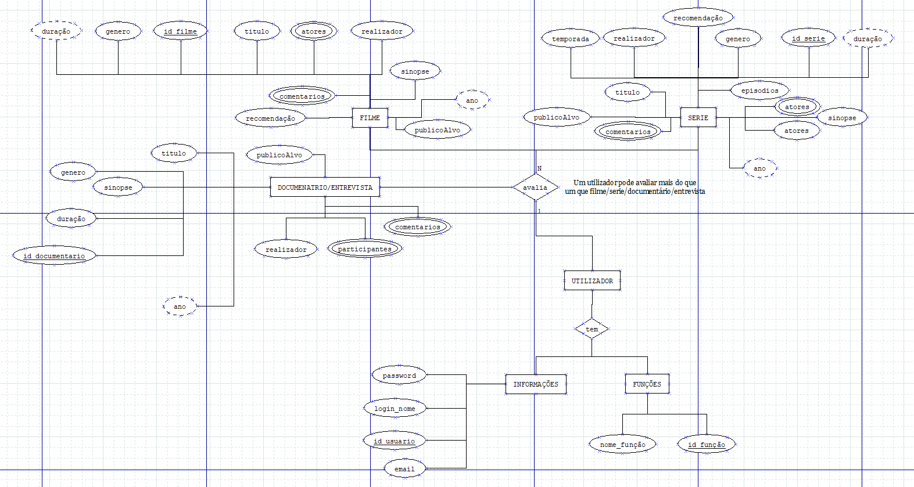

# C3 : Esquema conceptual

## Modelo E/A
_(Introduzir as entidade-tipo e associações do sistema, adicionalmente apresentar o diagrama do modelo Entidade-Associação.)_

Diagrama EA  
 

NOTA: Cada entidade-tipo e cada associação devem ter um pequeno texto – um ou dois parágrafos – para descrever esse elemento do modelo e os seus atributos)

## Regras de negócio adicionais (Restrições)
_(Apresentar uma lista detalhada das regras e restrições não possíveis de representar no modelo E/A, que visam a manutenção da consistência e integridade da modelação do problema)_